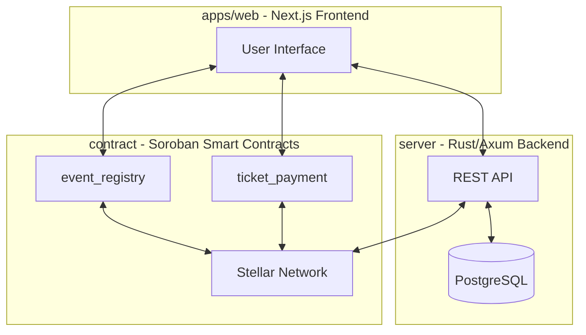
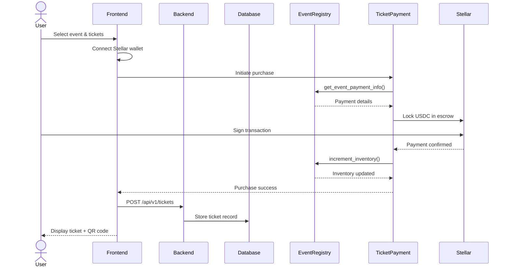
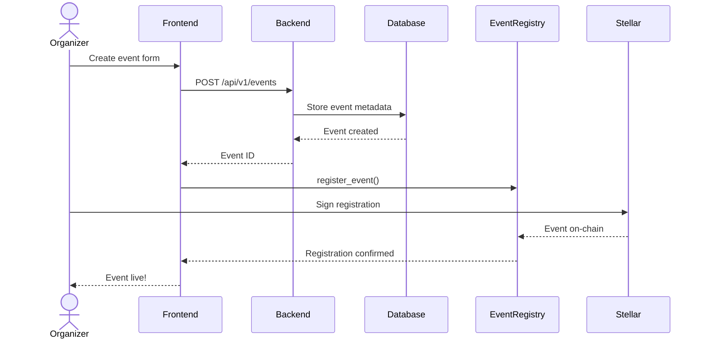
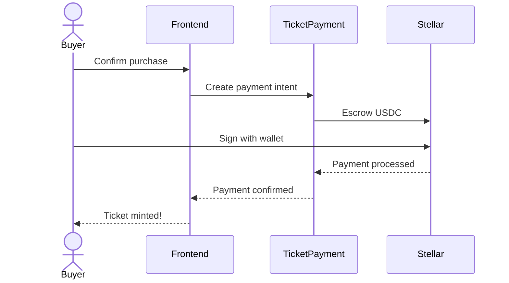
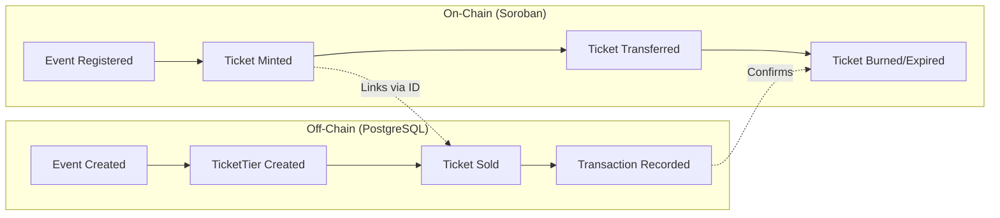
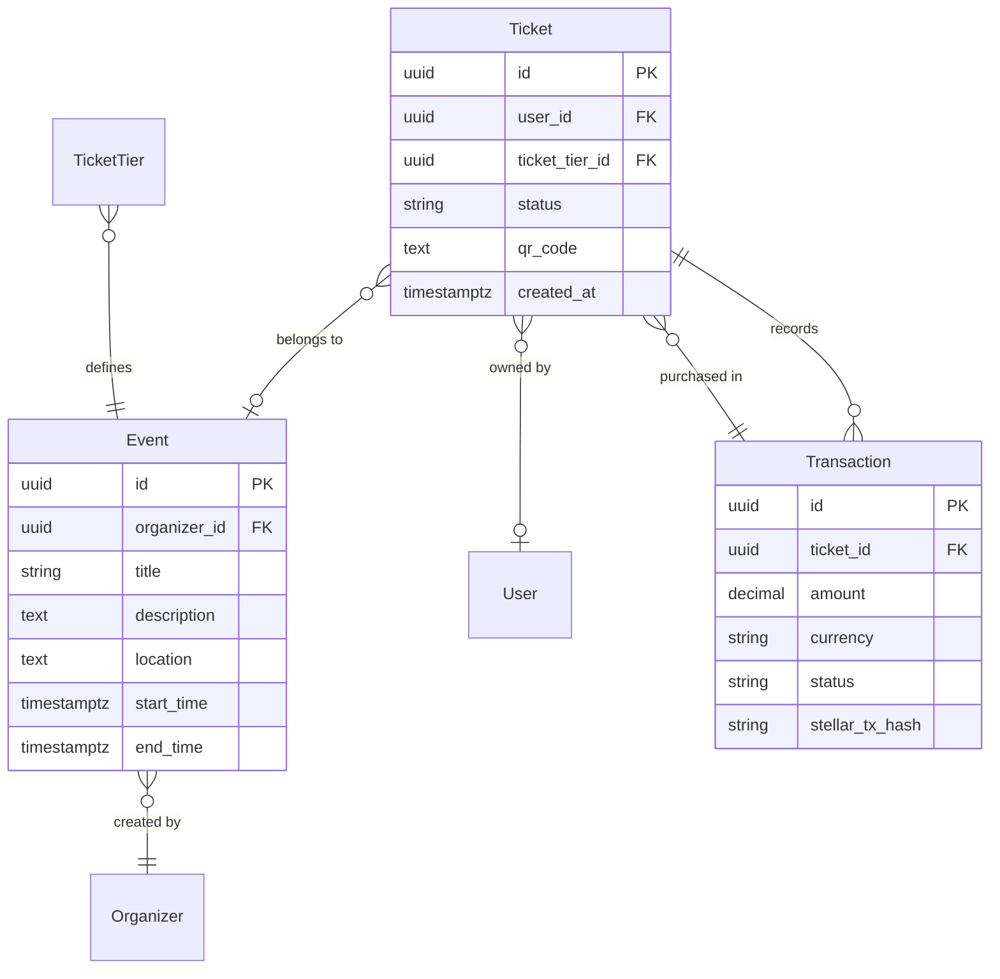
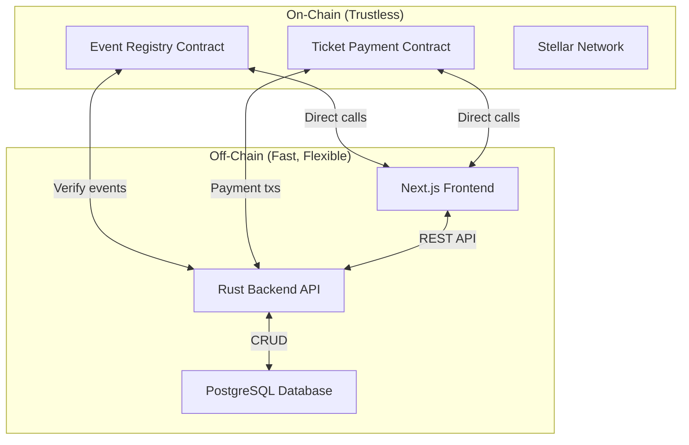

# Agora Architecture

> High-level system architecture and monorepo guide for developers.

## Table of Contents

1. [Overview](#overview)
2. [Monorepo Structure](#monorepo-structure)
3. [System Architecture](#system-architecture)
4. [System Flow](#system-flow)
5. [Ticketing Flow](#ticketing-flow)
6. [On-chain vs Off-chain](#on-chain-vs-off-chain)
7. [API Reference](#api-reference)
8. [Contributing](#contributing)

---

## Overview

Agora is an event and ticketing platform built on the **Stellar blockchain**. It enables organizers to create events, sell tickets, and manage attendees with **0% platform fees** on Pro plan, powered by fast, low-cost borderless payments using USDC.

The platform consists of three interconnected pillars:



---

## Monorepo Structure

```
agora/
├── apps/web/              # Next.js frontend application
├── server/                # Rust/Axum REST API backend
├── contract/              # Soroban smart contracts
├── docs/                  # Documentation
├── design/                # Design resources (Figma)
├── DEPLOYMENT_SETUP.md   # Deployment guide
├── TROUBLESHOOTING.md     # Common issues
└── README.md             # Project overview
```

### apps/web

**Purpose:** User-facing frontend application

**Tech Stack:**
- Next.js 14+ (App Router)
- React
- Tailwind CSS
- Framer Motion

**Key Directories:**
```
apps/web/
├── src/app/           # App router pages
├── src/components/    # React components
├── src/lib/          # Utilities and helpers
├── public/            # Static assets (icons, images)
└── DOCS/             # Component documentation
```

**Key Responsibilities:**
- Event browsing and discovery
- User authentication and profiles
- Event creation and management UI
- Ticket purchasing flow
- Organizer dashboard
- Real-time updates via Soroban RPC

---

### server

**Purpose:** REST API backend handling business logic and data persistence

**Tech Stack:**
- Rust
- Axum (web framework)
- PostgreSQL (via sqlx)
- tokio (async runtime)

**Key Directories:**
```
server/
├── src/
│   ├── routes/        # API route definitions
│   ├── handlers/     # Request handlers (controllers)
│   ├── models/       # Database entity structs
│   ├── config/       # Configuration (CORS, security headers)
│   └── utils/        # Error handling, response helpers
└── migrations/       # SQL schema migrations
```

**Key Responsibilities:**
- CRUD operations for events, organizers, users, tickets
- Database management and migrations
- Business logic and validation
- Authentication/authorization
- Stellar blockchain transaction submission
- API response formatting

**Database Models:**

| Model | Description |
|-------|-------------|
| `User` | Platform user with name, email |
| `Organizer` | Event creator with contact info |
| `Event` | Event details linked to organizer |
| `TicketTier` | Ticket type with price and quantity |
| `Ticket` | Individual ticket with status and QR code |
| `Transaction` | Payment record with Stellar tx hash |

**Entity Relationships:**
```
Organizer ──< Event ──< TicketTier ──< Ticket ──< Transaction
                                           └──────── User
```

---

### contract

**Purpose:** Soroban smart contracts for trustless event and ticketing operations

**Tech Stack:**
- Rust
- Soroban SDK 23
- Stellar SDK

**Key Directories:**
```
contract/
├── contracts/
│   ├── event_registry/   # Event management contract
│   └── ticket_payment/    # Payment processing contract
├── scripts/               # Deployment scripts
├── Cargo.toml            # Workspace definition
└── README.md             # Contract documentation
```

**Contracts:**

#### event_registry

Source of truth for event state. Handles:
- Event registration and metadata
- Organizer ownership and controls
- Ticket inventory management
- Loyalty and staking programs
- Multi-admin governance proposals

**Key Functions:**
| Function | Description |
|----------|-------------|
| `register_event(args)` | Create new event with tiers |
| `get_event(event_id)` | Retrieve event info |
| `update_event_status(event_id, is_active)` | Toggle event active state |
| `cancel_event(event_id)` | Permanently cancel event |
| `increment_inventory(event_id, tier_id, qty)` | Increase ticket counts |
| `decrement_inventory(event_id, tier_id)` | Decrease ticket counts |
| `authorize_scanner(event_id, scanner)` | Enable ticket check-in |
| `stake_collateral(organizer, amount)` | Stake for verification |

#### ticket_payment

Handles the monetary side of the platform:
- Payment processing and escrow
- Refunds (guest, admin, automatic, bulk, partial)
- Ticket transfers and resale
- Platform fee settlement
- Auction support

**Key Functions:**
| Function | Description |
|----------|-------------|
| `process_purchase(...)` | Process ticket payment |
| `confirm_payment(...)` | Record transaction hash |
| `refund(...)` | Process ticket refund |
| `transfer_ticket(...)` | Transfer ticket ownership |
| `claim_revenue(...)` | Withdraw organizer funds |

---

## System Architecture


**Component Description:**

| Component | Technology | Purpose |
|-----------|------------|---------|
| Frontend | Next.js | User interface, wallet connection |
| Backend | Rust/Axum | API server, business logic |
| Database | PostgreSQL | Persistent storage, fast queries |
| Blockchain | Stellar/Soroban | Ticket registry, USDC payments |

---

## System Flow

### Ticket Purchase Flow



### Event Creation Flow



### Payment Flow (USDC)



---

## Ticketing Flow

The "ticket" metaphor exists across both on-chain (Soroban) and off-chain (PostgreSQL) systems.



### On-Chain Ticket State (ticket_payment contract)

| State | Description |
|-------|-------------|
| **Minted** | Ticket created when purchase escrow confirmed |
| **Active** | Ticket held by buyer |
| **Transferred** | Ownership changed to another wallet |
| **Burned** | Consumed at event entry (check-in) |
| **Expired** | Past event date without use |

### Off-Chain Ticket Record (PostgreSQL)

| Field | Description |
|-------|-------------|
| `id` | UUID primary key |
| `user_id` | Buyer reference |
| `ticket_tier_id` | Ticket type reference |
| `status` | 'active', 'used', 'cancelled' |
| `qr_code` | Verification QR content |
| `created_at` | Purchase timestamp |

### Data Linkage



### Dual Representation

| Aspect | On-Chain | Off-Chain |
|--------|----------|-----------|
| **Ownership** | Soroban contract (trustless) | PostgreSQL (fast) |
| **Immutability** | Verifiable on ledger | Application-controlled |
| **Access** | Wallet required | Authenticated API |
| **Speed** | Slower (block time) | Instant queries |
| **Use Case** | Ticket rights, transfers | Display, analytics |

---

## On-Chain vs Off-Chain

Understanding the distinction between on-chain and off-chain data is crucial for contributing to Agora.



### On-Chain (Stellar/Soroban)

**What lives here:**
- Event registration and immutable metadata
- Ticket ownership and transfer history
- USDC escrow and payment processing
- Platform fee configuration
- Organizer staking and verification
- Governance proposals
- Loyalty score updates

**Characteristics:**
- Slow to query, fast to verify
- Requires wallet connection
- Globally accessible
- Cannot be modified/deleted
- Trustless execution
- Transaction costs (gas fees)

### Off-Chain (PostgreSQL/API)

**What lives here:**
- User profiles and preferences
- Event details and descriptions
- Ticket metadata for display
- Transaction history
- Analytics and reporting
- API caching
- QR code content

**Characteristics:**
- Fast queries, rich filtering
- Flexible updates and deletions
- Requires authentication
- Can be indexed and searched
- Centralized control
- No transaction costs

### When to Use Which

| Use Case | Storage | Reason |
|----------|---------|--------|
| Verify ticket ownership | On-chain | Trustless verification |
| List user's tickets | Off-chain | Fast, filtered query |
| Event details for display | Off-chain | Rich data, fast load |
| Event existence proof | On-chain | Immutable record |
| Payment amount | On-chain | Verifiable amount |
| Payment history | Off-chain | Fast retrieval |
| Check-in scanning | On-chain | Tamper-proof |
| Refund processing | Both | On-chain triggers, off-chain records |

---

## API Reference

### Base URL

| Environment | URL |
|-------------|-----|
| Development | `http://localhost:3001` |
| Production | Configured via deployment |

### Endpoints

| Method | Endpoint | Description |
|--------|----------|-------------|
| GET | `/api/v1/health` | Combined API + DB health |
| GET | `/api/v1/health/db` | Database-only health |
| GET | `/api/v1/health/ready` | Readiness probe |

### Response Format

**Success:**
```json
{
  "success": true,
  "data": {
    "status": "ok",
    "timestamp": "2026-04-24T10:00:00Z"
  },
  "message": "API is healthy"
}
```

**Error:**
```json
{
  "success": false,
  "error": {
    "code": "EXTERNAL_SERVICE_ERROR",
    "message": "API is not ready: database is unreachable"
  }
}
```

### Health Check Details

| Endpoint | Purpose | Returns 200 when |
|---------|---------|------------------|
| `/health` | API + DB | Both healthy |
| `/health/db` | DB only | Database reachable |
| `/health/ready` | Readiness | Service ready |

---

## Contributing

### Getting Started

```bash
# Clone the repository
git clone https://github.com/Agora-Events/agora.git
cd agora

# Install dependencies
pnpm install

# Run development servers
pnpm dev
```

### Repository Structure

```
agora/
├── apps/web/                # Frontend (Next.js)
│   ├── src/app/            # App router pages
│   ├── src/components/     # React components
│   └── public/              # Static assets
├── server/                  # Backend (Rust)
│   ├── src/
│   │   ├── routes/         # API route definitions
│   │   ├── handlers/       # Request handlers
│   │   ├── models/         # Database models
│   │   └── utils/          # Utilities
│   └── migrations/           # SQL migrations
└── contract/               # Smart contracts
    ├── contracts/
    │   ├── event_registry/ # Event management
    │   └── ticket_payment/  # Payment processing
    └── scripts/             # Deployment scripts
```

### Key Resources

- [Figma Design File](https://www.figma.com/design/cpRUhrSlBVxGElm18Fa2Uh/Agora-event)
- [Frontend Guidelines](apps/web/README.md)
- [Smart Contract Docs](contract/README.md)
- [Development Setup](DEPLOYMENT_SETUP.md)
- [Troubleshooting](TROUBLESHOOTING.md)

### Commit Convention

We follow conventional commits:

| Type | Description |
|------|-------------|
| `feat:` | New feature |
| `fix:` | Bug fix |
| `docs:` | Documentation |
| `refactor:` | Code refactoring |
| `test:` | Adding tests |

Example:
```bash
git commit -m "docs: add architecture documentation

Closes #363"
```
